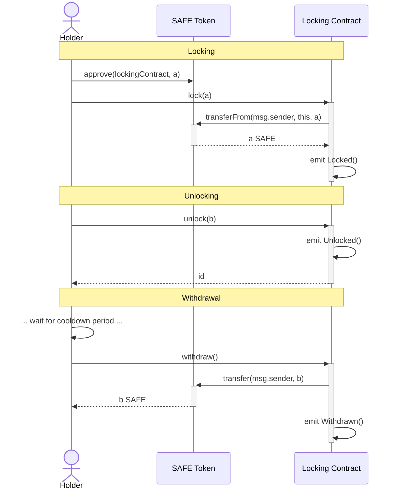

# Safe Token Locking Contract

## Introduction

Safe locking contract facilitates locking Safe tokens. Users can lock and unlock tokens anytime and also withdraw after the `COOLDOWN_PERIOD` is over. The contract also provides feature controlled by the admin address to recover ERC20 tokens other than Safe tokens.

## Mainnet Deployment

The Safe locking contract was deployed to Ethereum mainnet at address [`0x0a7CB434f96f65972D46A5c1A64a9654dC9959b2`](https://etherscan.io/address/0x0a7CB434f96f65972D46A5c1A64a9654dC9959b2). The deployment transaction was [`0xd90bbe97f71ca9cff6e7ee545a773d25fa34260624df681bf04592f5e7301b2e`](https://etherscan.io/tx/0xd90bbe97f71ca9cff6e7ee545a773d25fa34260624df681bf04592f5e7301b2e).

## Contract

### Contract behaviour

- The locking contract is designed for "continuous" locking (as opposed to a “discrete” locking mechanism). This means that:
  - Tokens can be locked at any time
  - Tokens can be unlocked at any time, where a transaction is issued to initiate the unlock and enter a “cool-down” period and a follow-up transaction is issued to withdraw the unlocked tokens after the cool-down period is over.
- The current specification considers locking age to be computed in a First-In-First-Out order (Calculated offchain). For example, a user:

  1.  Locks **100 SAFE** on **block** **1000000**
  2.  Locks **50 SAFE** on **block** **1000500**
  3.  Unlocks, then withdraws **75 SAFE**

  On block **1001000**, their locked SAFE amounts with ages would be:

  - **25 SAFE** locked for **1000 blocks**
  - **50 SAFE** locked for **500 blocks**

- `withdraw(...)` is defined to withdraw all matured unlocks (unlocks whose unlock time is greater than `block.timestamp`). This is an `O(n)` operation (where `n` is the number of matured unlocks). In order to support more deterministic gas usage, a `withdraw(maxUnlocks)` function is also provided to withdraw up to `maxUnlocks` of the oldest matured unlocks. For example, `withdraw(1)` can be used to withdraw only the oldest unlock if it is already matured, which is an `O(1)` operation.
- `getUserTokenBalance` returns the total `SAFE` token balance belonging to the `holder` within the locking contract, this includes locked tokens, unlocked tokens, and ready to withdraw tokens.
- Full accounting of locked tokens per user can be computable based on emitted events.
- The total `$SAFE` token balance in the locking contract belonging to any user can be readable on-chain or via a standard `eth_call` JSON RPC request. This MUST be made available by the `getUserTokenBalance(...)` contract method.
- The locking contract can allow simultaneous token unlock requests with separate cooldown ending timestamps based on an immutable cooldown period.
- The contract cannot allow the total sum of unlock request amounts to exceed the token holder’s `SAFE` balance in the contract.
- A withdrawal will withdraw the complete amount of its corresponding unlock request. That is, if a user calls `unlock(amount)`, then `withdraw()`, that unlock once matured, should transfer exactly `amount` `$SAFE` tokens to the holder (assuming no other unlocks were matured apart from that particular unlock operation).

#### Possible states for Tokens

- `Locked`: When the tokens are transferred from User using `transferFrom` for an indefinite period.
- `Unlocked`: Inititated by a user who already have certain amount of tokens locked. This state merely starts the unlock process from the current timestamp to a cooldown timestamp (calculated based on cooldown period).
- `Withdrawable`: This is the state of unlocked tokens ready to be withdrawn completely by the user. The tokens can remain in the contract indefinitely in this state, until the user withdraws.
- `Withdrawn`: This state is atomic, and can only be tracked on-chain based on logs emitted during the withdraw operation.

**Note**: Token enters the contract in `Locked` state (unless tokens are transferred directly without calling the `lock(...)`) and exits the contract from a `Withdrawable` state using the `withdraw(...)` to `Withdrawn` state as mentioned above.

### Contract State Change Explanation

| User | Operation | Time | Amount | users[User]                             | unlocks[index][User]                                | Note                                         |
| ---- | --------- | ---- | ------ | --------------------------------------- | --------------------------------------------------- | -------------------------------------------- |
| A    | Lock      |      | X1     | (X1, 0, 0, 0)                           |                                                     |                                              |
| A    | Unlock    |      | X2     | (X1 - X2, X2, 0, 1)                     | unlocks[0][A] → (X2, t1)                            |                                              |
| B    | Lock      |      | Y1     | (Y1, 0, 0, 0)                           |                                                     |                                              |
| A    | Unlock    |      | X3     | (X1 - X2 - X3, X2 + X3, 0, 2)           | unlocks[1][A] → (X3, t2)                            |                                              |
| B    | Unlock    |      | Y2     | (Y1 - Y2, Y2, 0, 1)                     | unlocks[0][B] → (Y2, t2)                            |                                              |
| A    | Unlock    |      | X4     | (X1 - X2 - X3 - X4, X2 + X3 + X4, 0, 3) | unlocks[2][A] → (X4, t2)                            |                                              |
| A    | Withdraw  | t1   |        | (X1 - X2 - X3 - X4, X3 + X4, 1, 3)      | unlocks[0][A] → (0, 0) ???                          |                                              |
| B    | Unlock    |      | Y3     | (Y1 - Y2 - Y3, Y2 + Y3, 0, 2)           | unlocks[1][B] → (Y3, t3)                            |                                              |
| A    | Withdraw  | t2   |        | (X1 - X2 - X3 - X4, 0, 3, 3)            | unlocks[2][A] → (0, 0) & unlocks[3][A] → (0, 0) ??? | Here 2 withdraw happens, as time t2 reached. |
| B    | Withdraw  |      |        | (Y1 - Y2 - Y3, Y3, 1, 2)                | unlocks[0][B] → (0, 0) ???                          |                                              |

Basic assumptions like `X1 > X2 + X3 + X4` and `Y1 > Y2 + Y3` are applicable. For a numerical example, please check [here](./docs/Implementation.md).

### Contract Implementation Details

Contract implementation details can be found in the [docs folder](./docs/Implementation.md).

**Note**: Any Safe tokens sent to the contract other than use of `lock(...)` function cannot be recovered and will be deposited to the contract forever.

### User Actions Sequence Diagram



## Audits

- [Ackee Audit Report](./docs/audits/ackee-blockchain-safe-token-locking-report-1.1.pdf)
- [Certora Audit Report](./docs/audits/Safe%20-%20Certora%20security%20report.pdf)

## Usage

### Install requirements with yarn:

```bash
npm ci
```

### Run tests:

#### Locally

```bash
npm run test
```

#### E2E

```bash
npm run test:e2e
```

NOTE: To run E2E test, `INFURA_KEY` in `.env` with the appropriate value to fork the Ethereum Mainnet.

#### All tests

```bash
npm run test:all
```

#### Formal Verification

First setup a Python virtual environment and install required Certora dependencies:

```bash
python3 -m venv venv
. venv/bin/activate
pip install -r certora/requirements.txt
```

Install the correct `solc` binary version. On Linux:

```bash
wget https://github.com/ethereum/solidity/releases/download/v0.8.23/solc-static-linux
chmod +x solc-static-linux
sudo mv solc-static-linux /some/directory/in/your/path/solc-0.8.23
```

To execute the formal verification specification:

```bash
export CERTORAKEY="..."
certoraRun certora/conf/SafeTokenLock.conf
```

Note: To use a Solidity compiler at custom path, run with:

```bash
certoraRun certora/conf/SafeTokenLock.conf --solc /path/to/solc
```

### Deploy

> :warning: **Make sure to use the correct commit when deploying the contracts.** Any change (even comments) within the contract files will result in different addresses. The tagged versions can be found in the [releases](https://github.com/safe-global/safe-locking/releases).

This will deploy the contracts deterministically and verify the contracts on etherscan using [Solidity 0.8.23](https://github.com/ethereum/solidity/releases/tag/v0.8.23) by default.

Preparation:

- Set `MNEMONIC` in `.env`
- Set `INFURA_KEY` in `.env`

```bash
npm run deploy-all <network>
```

This will perform the following steps

```bash
npm run build
npm run hardhat --network <network> deploy
npm run hardhat --network <network> etherscan-verify
npm run hardhat --network <network> local-verify
```

#### Custom Networks

It is possible to use the `CUSTOM_NODE_URL` env var to connect to any EVM based network via an RPC endpoint. This connection then can be used with the `custom` network.

E.g. to deploy the Safe contract suite on that network you would run `npm run deploy-all custom`.

The resulting addresses should be on all networks the same.

Note: Address will vary if contract code is changed or a different Solidity version is used.

## Security and Liability

All contracts are WITHOUT ANY WARRANTY; without even the implied warranty of MERCHANTABILITY or FITNESS FOR A PARTICULAR PURPOSE.

## License

All smart contracts are released under LGPL-3.0
