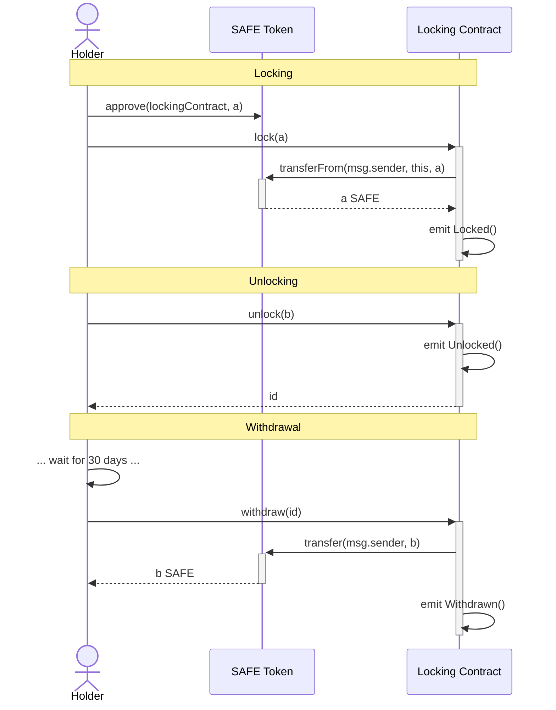

# Safe Locking Contract

## Contract

### Contract behaviour



### Contract Implementation Details

Contract implementation details can be found in the [docs folder](./docs/Implementation.md).

<!--
### Audits
- [](./docs/)
-->

## Usage

### Install requirements with yarn:

```bash
npm ci
```

### Run all tests:

```bash
npm run build
npm run test
```

### Deploy

> :warning: **Make sure to use the correct commit when deploying the contracts.** Any change (even comments) within the contract files will result in different addresses. The tagged versions can be found in the [releases](https://github.com/safe-global/safe-locking/releases).

This will deploy the contracts deterministically and verify the contracts on etherscan using [Solidity 0.8.23](https://github.com/ethereum/solidity/releases/tag/v0.8.23) by default.

Preparation:

- Set `MNEMONIC` in `.env`
- Set `INFURA_KEY` in `.env`

```bash
npm run deploy-all <network>
```

This will perform the following steps

```bash
npm run build
npm run hardhat --network <network> deploy
npm run hardhat --network <network> etherscan-verify
npm run hardhat --network <network> local-verify
```

#### Custom Networks

It is possible to use the `NODE_URL` env var to connect to any EVM based network via an RPC endpoint. This connection then can be used with the `custom` network.

E.g. to deploy the Safe contract suite on that network you would run `npm run deploy-all custom`.

The resulting addresses should be on all networks the same.

Note: Address will vary if contract code is changed or a different Solidity version is used.

## Security and Liability

All contracts are WITHOUT ANY WARRANTY; without even the implied warranty of MERCHANTABILITY or FITNESS FOR A PARTICULAR PURPOSE.

## License

All smart contracts are released under LGPL-3.0
